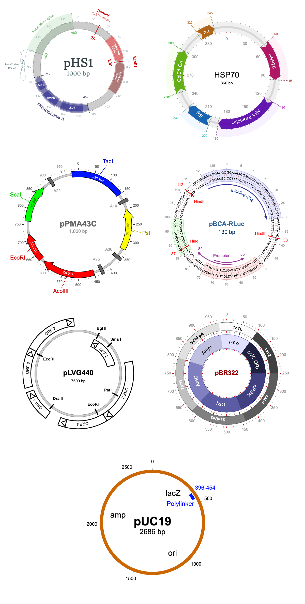

# Nextstrain/Nextclade visualisation

We have recreated the Nextstrain/Nextclade table as a reusable web component.



## Using this component

There are three strategies we recommend for using the `@metrichor/nextclade` web component built with Stencil.

### Script tag

- Put a script tag similar to this `<script src='https://unpkg.com/@metrichor/nextclade@0.0.11/dist/nextclade/nextclade.esm.js'></script>` in the head of your index.html
- Then you can use the element anywhere in your template, JSX, html etc

### Node Modules
- Run `npm install @metrichor/nextclade --save`
- Put a script tag similar to this `<script src='node_modules/@metrichor/nextclade/dist/nextclade/nextclade.esm.js'></script>` in the head of your index.html
- Then you can use the element anywhere in your template, JSX, html etc

### In a stencil-starter app
- Run `npm install @metrichor/nextclade --save`
- Add an import to the npm packages `import @metrichor/nextclade;`
- Then you can use the element anywhere in your template, JSX, html etc


## Visualising Nextstrain/Nextclade data

To use the Nextclade table in your HTML you will need to create a [nxt-table](./src/components/nxt-table/readme.md) tag and set the data attribute with the output from the Nextstrain/Nextclade pipeline

For example

```html
<body>
  <nxt-table />
  <script defer>
    const data = [
      {
        "seqName": "barcode02 MN908947.3",
        "errors": [
          "Unable to align: no seed matches"
        ]
      },
      {
        "seqName": "Bangladesh/BCSIR-NILMRC-257/2020",
        "substitutions": [
          {
            "pos": 240,
            "refNuc": "C",
            "queryNuc": "T",
            "aaSubstitutions": [],
            "pcrPrimersChanged": [],
            ...
          }
        ],
        ...
      }
      ...
    ],

    var nxt = document.querySelector('nxt-table')
    nxt.data = data
  </script>
</body>
```
