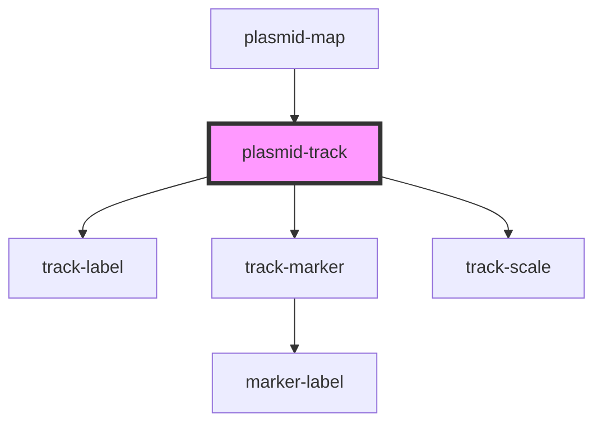

# plasmid-track

<!-- Auto Generated Below -->

## Properties

| Property     | Attribute    | Description                 | Type     | Default                    |
| ------------ | ------------ | --------------------------- | -------- | -------------------------- |
| `radius`     | `radius`     | track radius                | `number` | `100`                      |
| `trackclass` | `trackclass` | CSS class for track         | `string` | `''`                       |
| `trackstyle` | `trackstyle` | CSS element style for track | `string` | `'fill:#ccc;stroke:#999;'` |
| `width`      | `width`      | track width                 | `number` | `25`                       |

## Methods

### `draw(plasmidMapInstance?: PlasmidMap, svgRoot?: SVGElement) => Promise<void>`

Called by [plasmid-map](..) parent passing in the host instance and element

#### Returns

Type: `Promise<void>`

## Dependencies

### Used by

 - [plasmid-map](..)

### Depends on

- [track-label](track-label)
- [track-marker](track-marker)
- [track-scale](track-scale)

### Graph

----------------------------------------------

*Built with [StencilJS](https://stenciljs.com/)*
