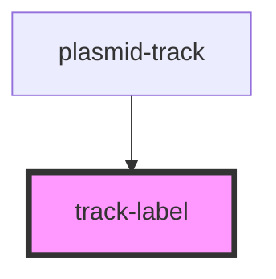

# track-label

<!-- Auto Generated Below -->

## Properties

| Property     | Attribute    | Description                | Type     | Default |
| ------------ | ------------ | -------------------------- | -------- | ------- |
| `hadjust`    | `hadjust`    | horizontal adjustment      | `number` | `0`     |
| `labelclass` | `labelclass` | CSS class for label        | `string` | `''`    |
| `labelstyle` | `labelstyle` | CSS style rules on element | `string` | `''`    |
| `text`       | `text`       | label text                 | `string` | `''`    |
| `vadjust`    | `vadjust`    | vertical adjustment        | `number` | `0`     |

## Methods

### `draw(plasmidTrackInstance?: PlasmidTrack, trackGroupEl?: SVGGElement) => Promise<void>`

Called by [plasmid-track](..) parent passing in the host instance and element

#### Returns

Type: `Promise<void>`

## Dependencies

### Used by

 - [plasmid-track](..)

### Graph

----------------------------------------------

*Built with [StencilJS](https://stenciljs.com/)*
