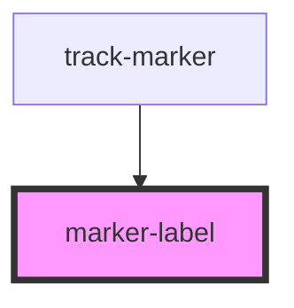

# marker-label

<!-- Auto Generated Below -->

## Properties

| Property      | Attribute     | Description                                 | Type                             | Default    |
| ------------- | ------------- | ------------------------------------------- | -------------------------------- | ---------- |
| `hadjust`     | `hadjust`     | horizontal adjustment of label              | `number`                         | `0`        |
| `halign`      | `halign`      | vertical adjustment of label                | `"end" \| "middle" \| "start"`   | `'middle'` |
| `href`        | `href`        | link                                        | `string`                         | `''`       |
| `labelclass`  | `labelclass`  | CSS element style of label                  | `string`                         | `''`       |
| `labelstyle`  | `labelstyle`  | CSS class of label                          | `string`                         | `''`       |
| `lineclass`   | `lineclass`   | CSS class of label line                     | `string`                         | `''`       |
| `linestyle`   | `linestyle`   | CSS element style of label line             | `string`                         | `''`       |
| `linevadjust` | `linevadjust` | vertical adjustment of label line           | `number`                         | `0`        |
| `showline`    | `showline`    | show/hide label line                        | `boolean`                        | `false`    |
| `target`      | `target`      | link target                                 | `string`                         | `''`       |
| `text`        | `text`        | label text                                  | `string`                         | `''`       |
| `type`        | `type`        | render label as either SVG text or textPath | `"path" \| "text"`               | `'text'`   |
| `vadjust`     | `vadjust`     | DOC                                         | `number`                         | `0`        |
| `valign`      | `valign`      | vertical alignment of label                 | `"inner" \| "middle" \| "outer"` | `'middle'` |

## Methods

### `draw(trackMarkerInstance?: TrackMarker, trackMarkerGroupEl?: SVGGElement) => Promise<void>`

Called by [track-marker](..) parent passing in the host instance and element

#### Returns

Type: `Promise<void>`

## Dependencies

### Used by

 - [track-marker](..)

### Graph

----------------------------------------------

*Built with [StencilJS](https://stenciljs.com/)*
