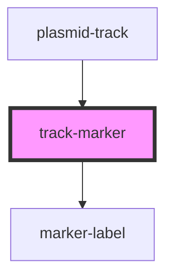

# track-marker

<!-- Auto Generated Below -->

## Properties

| Property           | Attribute          | Description                                                          | Type     | Default     |
| ------------------ | ------------------ | -------------------------------------------------------------------- | -------- | ----------- |
| `arrowendangle`    | `arrowendangle`    | end arrow - angle of left and right corner sensible values -3 -> 3   | `number` | `0`         |
| `arrowendlength`   | `arrowendlength`   | length of arrow                                                      | `number` | `0`         |
| `arrowendwidth`    | `arrowendwidth`    | width of arrow                                                       | `number` | `0`         |
| `arrowstartangle`  | `arrowstartangle`  | start arrow - angle of left and right corner sensible values -3 -> 3 | `number` | `0`         |
| `arrowstartlength` | `arrowstartlength` | start arrow length                                                   | `number` | `0`         |
| `arrowstartwidth`  | `arrowstartwidth`  | start arrow width                                                    | `number` | `0`         |
| `end`              | `end`              | end position (given sequence or sequence length)                     | `number` | `undefined` |
| `markerclass`      | `markerclass`      | CSS marker class                                                     | `string` | `''`        |
| `markerstyle`      | `markerstyle`      | CSS element style                                                    | `string` | `''`        |
| `start`            | `start`            | start position (given sequence or sequence length)                   | `number` | `0`         |
| `vadjust`          | `vadjust`          | vertical adjustment of marker                                        | `number` | `0`         |
| `wadjust`          | `wadjust`          | marker width adjustment                                              | `number` | `0`         |

## Methods

### `draw(plasmidTrackInstance?: PlasmidTrack, trackGroupEl?: SVGGElement) => Promise<void>`

Called by [plasmid-track](..) parent passing in the host instance and element

#### Returns

Type: `Promise<void>`

## Dependencies

### Used by

 - [plasmid-track](..)

### Depends on

- [marker-label](marker-label)

### Graph

----------------------------------------------

*Built with [StencilJS](https://stenciljs.com/)*
