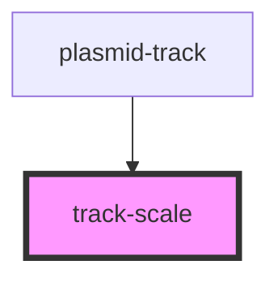

# track-scale

<!-- Auto Generated Below -->

## Properties

| Property       | Attribute      | Description                   | Type         | Default         |
| -------------- | -------------- | ----------------------------- | ------------ | --------------- |
| `direction`    | `direction`    | `'in'` is inverse direction   | `"" \| "in"` | `''`            |
| `interval`     | `interval`     | scale interval                | `number`     | `0`             |
| `labelclass`   | `labelclass`   | CSS class of label            | `string`     | `''`            |
| `labelstyle`   | `labelstyle`   | CSS element style of label    | `string`     | `''`            |
| `labelvadjust` | `labelvadjust` | vertical adjustment of labels | `number`     | `15`            |
| `showlabels`   | `showlabels`   | show/hide labels              | `boolean`    | `false`         |
| `tickclass`    | `tickclass`    | CSS class of tick             | `string`     | `''`            |
| `ticksize`     | `ticksize`     | relative size tick is drawn   | `number`     | `3`             |
| `tickstyle`    | `tickstyle`    | CSS element style of tick     | `string`     | `'stroke:#999'` |
| `vadjust`      | `vadjust`      | vertical adjustment           | `number`     | `0`             |

## Methods

### `draw(plasmidTrackInstance?: PlasmidTrack, trackGroupEl?: SVGGElement) => Promise<void>`

Called by [plasmid-track](..) parent passing in the host instance and element

#### Returns

Type: `Promise<void>`

## Dependencies

### Used by

 - [plasmid-track](..)

### Graph

----------------------------------------------

*Built with [StencilJS](https://stenciljs.com/)*
