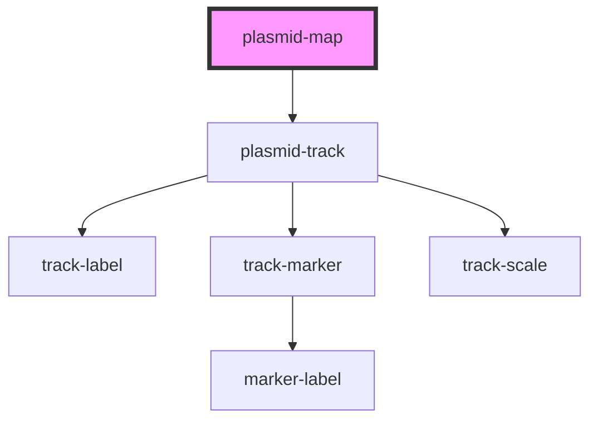

# plasmid-map

<!-- Auto Generated Below -->

## Properties

| Property         | Attribute        | Description                         | Type     | Default |
| ---------------- | ---------------- | ----------------------------------- | -------- | ------- |
| `plasmidheight`  | `plasmidheight`  | SVG image height                    | `number` | `300`   |
| `plasmidwidth`   | `plasmidwidth`   | SVG image width                     | `number` | `300`   |
| `rotate`         | `rotate`         | SVG image height                    | `number` | `0`     |
| `sequence`       | `sequence`       | nucleotide sequence `"ACGTGCCT..."` | `string` | `''`    |
| `sequencelength` | `sequencelength` | Plasmid sequence length             | `number` | `0`     |

## Dependencies

### Depends on

- [plasmid-track](plasmid-track)

### Graph

----------------------------------------------

*Built with [StencilJS](https://stenciljs.com/)*
